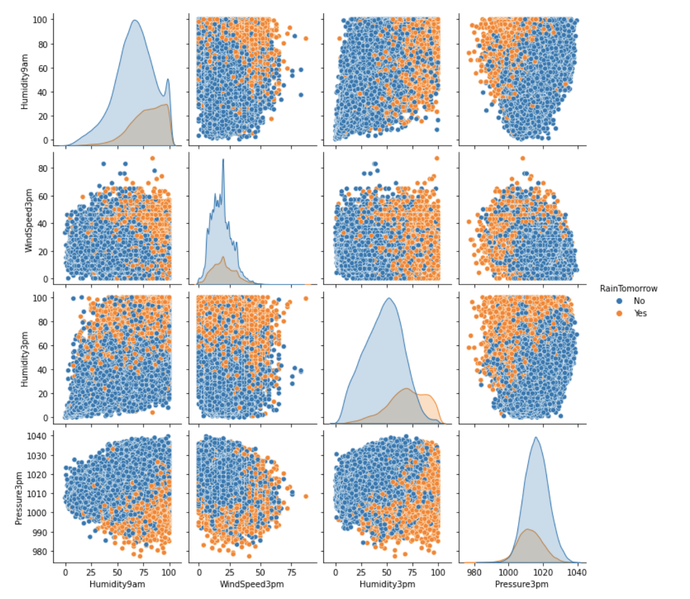

### Weather in Australia

##### The aim of this project to explain the weather in Australia and build a best classification model that can predict whether it is going to rain or not. Data was loaded as a pandas dataframe and cleaned by getting rid of nulls and changing data types. 
##### EDA was performed to understand the interaction of the target with the features. Correlation matrix and VIF scores together were considered in feature selection.
  

#### I started my modeling process with a few selected features on KNN with strafied test/train/val to address the imbalance in my target variable classes. Initial accuracy of 0.82 was achieved. Gridsearch was conducted to find out the best n_neighbors and final accuracy on test data is 0.83. Please review below confusion matrix and cross validation accuracy.

      

#### Work in process:
#### 1) Logistic Regression Gridsearch for best hyperparameters. Baseline model produced accuracy = 0.83
#### 2) Random forests - Even though interpretability is less, will try it out to compare accuracy
#### 3) Tableau Dashboard - [Dashboard in progress](https://public.tableau.com/views/MetisClassification/Sheet2?:language=en-US&:display_count=n&:origin=viz_share_link)
