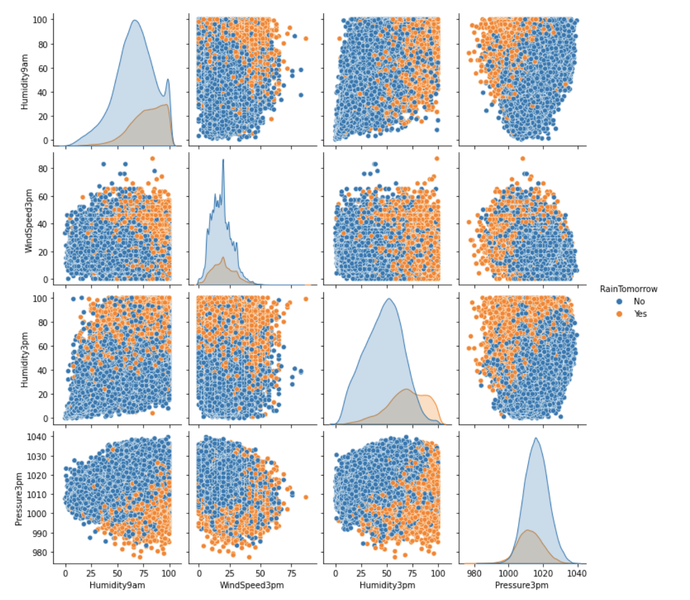

### Weather in Australia

##### The aim of this project to explain the weather in Australia and build a best classification model that can predict whether it is going to rain or not. Data was loaded as a pandas dataframe and cleaned by getting rid of nulls. 
##### EDA was performed to understand the interaction of the target with the features. Correlation matrix and VIF scores together were considered in feature selection.

