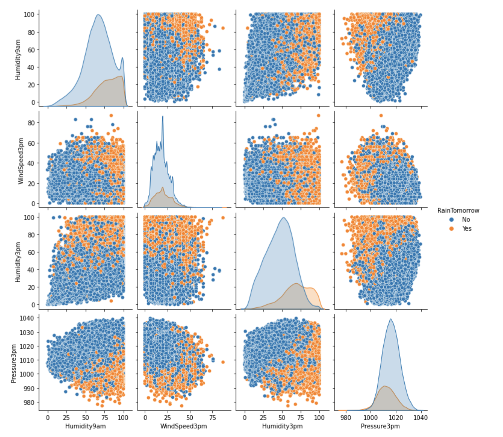

# Predicting Rain in Australia

Weather in Australia is becoming unpredictable, parts of the country is currently facing massive floods from heavy rainfall. Not long ago, there were devastating forest fires in the country. The aim of this project is to make weather more predictable and understand the main indicators of the rain. Data was obtained from [Kaggle](https://www.kaggle.com/jsphyg/weather-dataset-rattle-package) which 10 year weather data. 

EDA was performed and pairplot revealed some important features that were seperating the predicting variable.

 

An accuracy of 0.85 was obtained utilizing XG Boost. 

# Workflow
1. [Exploratory Data Analysis](https://github.com/PrasunaM/Predicting_Rain_Aus-MetisClassification/blob/fae04555cc856688f4ff78264380d1980818d36e/Final_Submission/Eda_weather.ipynb)
2. [K Nearest Neighbors](https://github.com/PrasunaM/Predicting_Rain_Aus-MetisClassification/blob/fae04555cc856688f4ff78264380d1980818d36e/Final_Submission/KNN.ipynb)
3. [Logistic Regression](https://github.com/PrasunaM/Predicting_Rain_Aus-MetisClassification/blob/fae04555cc856688f4ff78264380d1980818d36e/Final_Submission/Logistic_Regression_Weather.ipynb)
4. [Random Forest](https://github.com/PrasunaM/Predicting_Rain_Aus-MetisClassification/blob/fae04555cc856688f4ff78264380d1980818d36e/Final_Submission/Random_Forest_weather.ipynb) 
5. [Presentation Slides](https://github.com/PrasunaM/Predicting_Rain_Aus-MetisClassification/blob/22c3b53c28ad92ad029d39f918dcfee4ff9b3e3b/Final_Submission/MetisClassificationFinalPresentation.pdf)

# Conclusion

Feature importance revealed that Humidity at 3PM the day before influences if it is going to rain the next day. 
